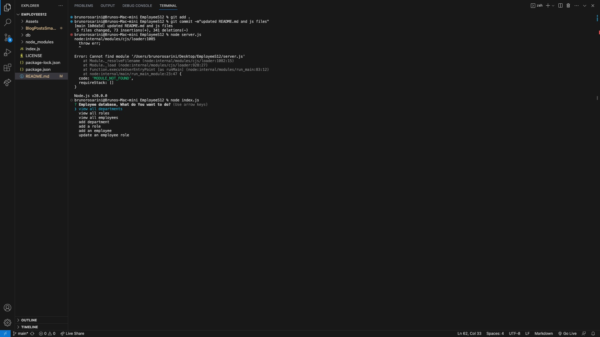
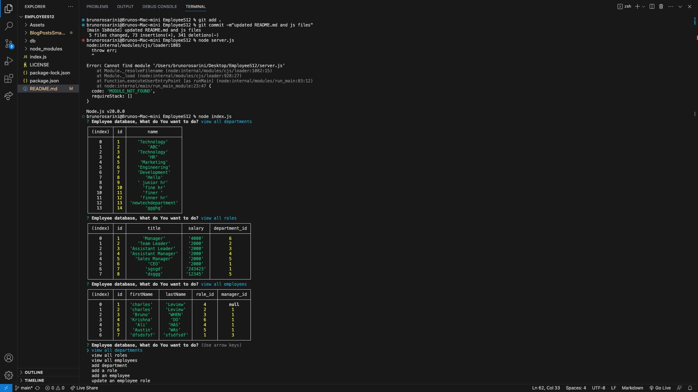

# EmployeeSmasher

# 

## Table of Contents

- [Description](#description)
- [Contributing](#contributing)
- [Tests](#tests)
- [Questions](#questions)

## Images

---

---

---

## Description

I have created a command-line application that accepts user input

WHEN I start the application, I am presented with the following options: view all departments, view all roles, view all employees, add a department, add a role, add an employee, and update an employee role.

WHEN I choose to view all departments, I am presented with a formatted table showing department names and department ids.

WHEN I choose to view all roles, I am presented with the job title, role id, the department that role belongs to, and the salary for that role.

WHEN I choose to view all employees, I am presented with a formatted table showing employee data, including employee ids, first names, last names, job titles, departments, salaries, and managers that the employees report to.

WHEN I choose to add a department, I am prompted to enter the name of the department and that department is added to the database.

WHEN I choose to add a role, I am prompted to enter the name, salary, and department for the role and that role is added to the database.

WHEN I choose to add an employee, I am prompted to enter the employee’s first name, last name, role, and manager, and that employee is added to the database.

WHEN I choose to update an employee role, I am prompted to select an employee to update and their new role and this information is updated in the database.

## License

This project is licensed under the MIT license. For more information about the license, go to [License](https://choosealicense.com/licenses/mit/).

## Creator

Bruno Rosarini

## Contributing

Krishna The TA
Luis Sanchez
Austin Grech

## Tests

test video: 

## Questions

For any questions, please reach out via GitHub or email:

- GitHub: [BrunoRosarini] (https://github.com/RdySetShine/EmployeeSmasher)

- Email: (rosarinibruno@gmail.com)